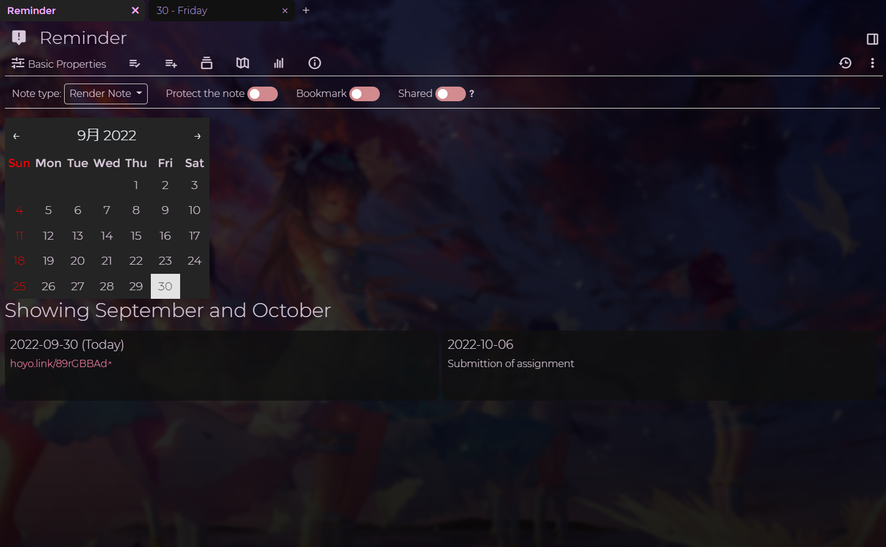
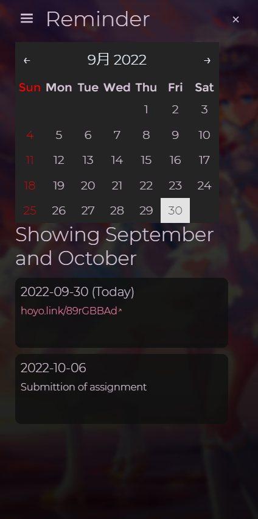
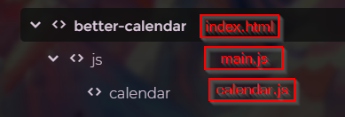

# trilium-better-calendar
Render Trilium calendar (date notes) for both desktop and mobile version.




# Setup

1. Create note files.


  - Note type for `.html` file is `HTML`
  - Note type for `.js` file is `JS Frontend`
  
__The name of note for `calendar.js` should not be changed__

2. Find out the note ID of your `#calendarRoot` note and replace the value in `main.js`
```js
let rootNoteId = 'hE1GZ8Qp5d1y' // replace it
```

3. Change the note type of your `#calendarRoot` note to `render note`. (You may use other note if you want)

4. Add `~renderNote` relation and link the `HTML` note created above
